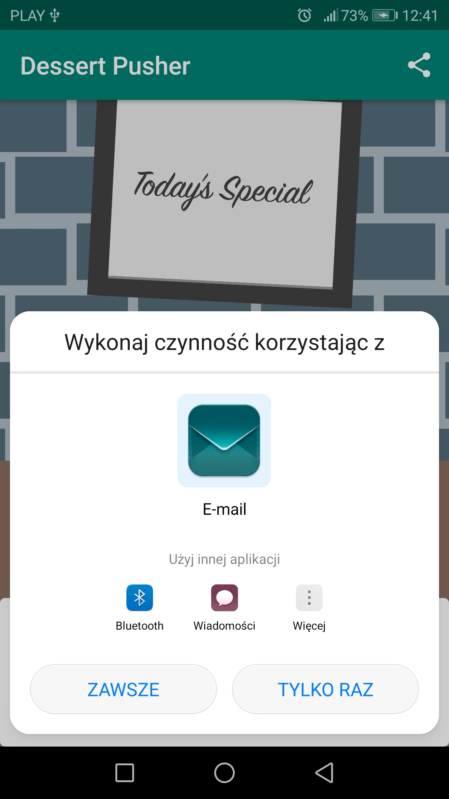

# DesertPusher
> This app is for exploring the Activity Lifecycle callback methods and the Lifecycle object.

## Table of contents
* [General info](#general-info)
* [Screenshots](#screenshots)
* [Technologies](#technologies)
* [Setup](#setup)
* [Status](#status)

## General info
The main goal of this project was to start writing Android code in Kotlin and learn how to deal with Android components using the core Kotlin features.
DessertPusher is a game about making desserts. Press the button, make a dessert, earn the big bucks.

## Screenshots

## Technologies
* Kotlin - 1.3.30
* Android Studio

## Setup
* Clone or download ZIP repository https://github.com/Damian9696/Android_Kotlin_DessertPusher
* Import the project into Android Studio

## Status
* Project is: _finished_. The project was not created for future updates
